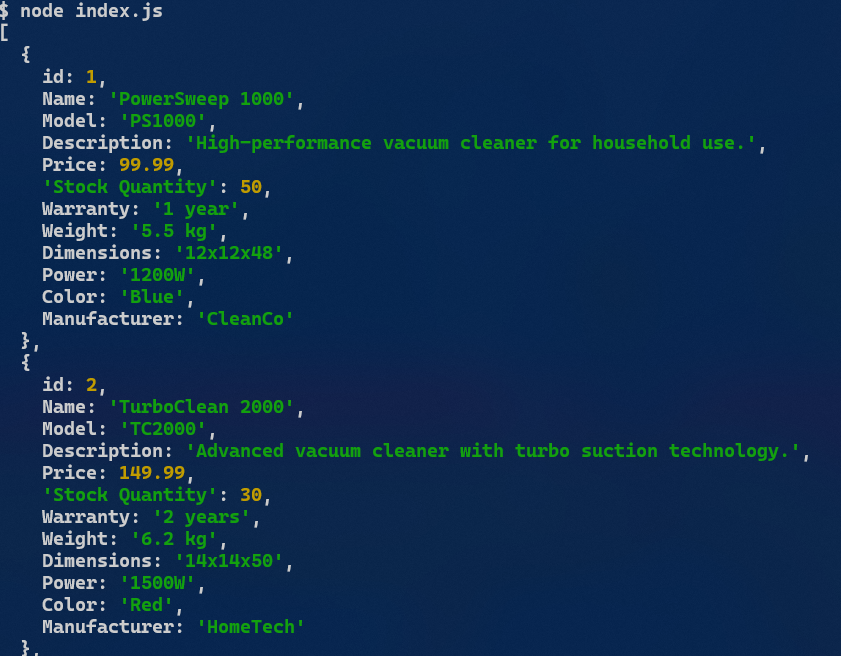

```js
const XLSX = require("xlsx");

const filePath = "./Products Dreame.en.xlsx";

const workbook = XLSX.readFile(filePath);
const sheetName = workbook.SheetNames[0];
const sheet = workbook.Sheets[sheetName];

const data = XLSX.utils.sheet_to_json(sheet);
console.log(data);
```

- Array of object



```js
const data = XLSX.utils.sheet_to_json(sheet, { header: 0 });
```

- Array of object
- Có chứa key của cột


```js
const data = XLSX.utils.sheet_to_json(sheet, { header: 1 });
```

- Array of array
- Extract dòng tiêu đề
- Những row sẽ không có key


```js
const data = XLSX.utils.sheet_to_json(sheet, { header: 0, raw: false });
```

- raw: false -> result is string, keep original value
  
- raw: true -> result is number, string ...
  

```js
const data = XLSX.utils.sheet_to_json(sheet, { header: 0, range: "A1:B2" });
```

- range: "A1:B2" -> get data from A1 to B2 (A1,B1,A2,B2)
- blankrows:
  - true -> include blank rows
  - false -> skipped blank rows

# defval: default value for blank cell

```js
const data = XLSX.utils.sheet_to_json(sheet, {
  header: 0,
  defval: "tmp-blank",
});
```

# Extract Column

```js
let data = XLSX.utils.sheet_to_json(sheet, { header: 0 });

const firstColumn = data.map((row) => row["id"]);

data = XLSX.utils.sheet_to_json(sheet, { header: 1 });
const secondColumn = data.map((row) => row[0]);

console.log(firstColumn);
console.log(secondColumn);
```

```bash
node index.js

[
  1, 2, 3, 4,  5,
  6, 7, 8, 9, 10
]
[
  'id', 1, 2,  3,
  4,    5, 6,  7,
  8,    9, 10
]
```

- Sử dụng header: 0 -> ta được array of object và không chứa row tittle, khi đó ta chỉ cần map tới value của tên cột là được (key của object)
- Sử dụng header: 1 -> ta được array of array và chứa row tittle, khi đó ta chỉ cần map tới index của cột là được -> cách này sẽ cần dùng index
