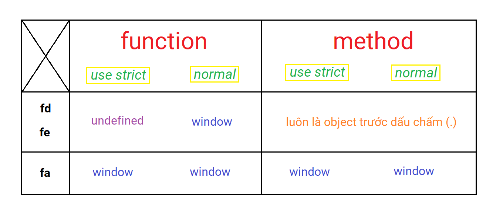
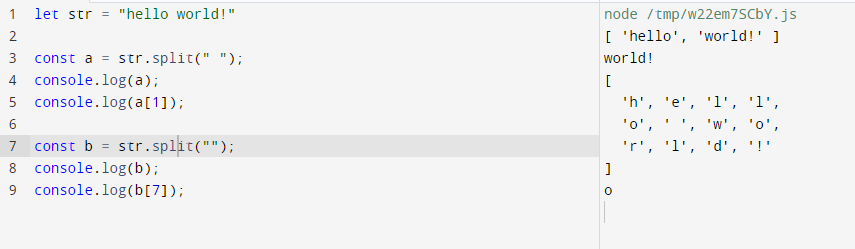

# 01 - Variable, Hoisting, Scope

## Variable

- `var, let, const`
- var appear at the most early stage of js
- let, const appear at ES6

## Var cause hoisting

> it's a feature, not a bug!!!!!

- default using `const`
- when need to change the value, use `let`

> should use let, const instead of var

```js
if(true){
  var toilet = "hello"
}
console.log(toilet) // hello

let a  = 10;

const add = (a, b) => return a + b;
```

# 02 - Data Type, Pass by Value, Pass by Reference

## Primitive Data Type

- number: 1, 2, 3
- string: "hello"
- boolean: true, false
- null: empty value but `know the type`
- undefined: empty value and `don't know the type`

```js
console.log(typeof null); //object

console.log(typeof undefined); //undefined
```

### == vs ===

- ==: compare the value
- ===: compare the value and type

```js
console.log(2 == "2"); //true
console.log(2 === "2"); //false
```

## Object Data Type

> key - value pair

- plain object:

```js
let student = { name: "Tùng", point: 10 };
```

### Array is also an object

- can contain any type of data

```js
let flowerList = ["Hoa", "Cúc", "Hồng", 10];
```

### Regex is also an object

```js
var regex1 = /SE\d{9}/;
console.log(typeof regex1); //object
```

## Function is also an object

```js
const handle1(a, b) => return a + b;

console.log(typeof handle1); //function
```

# 03-Loops

## for

- for: loop through the index of an array
- for in: loop through the `key` of an object
- for of: loop through the `value of an array`

### for in

```js
var student1 = { name: "Điệp", point: 10, major: "SE" };

for (const x in student1) {
  // x đại diện cho một cái key trong object
  console.log(x); //name, point, major
}
```

> set là một tập hợp cấm trùng, không có key

```js
var demoSet = new Set(["Điệp", "Huệ", "Lan", "Huệ"]);

console.log(demoSet); // Set(3) {"Điệp", "Huệ", "Lan"}

for (const key in demoSet) {
  console.log(key); //không có gì
  //vì set không có key lấy đâu mà duyệt
}
```

### for of

> use iterator

```js
for (const value of student1) {
  console.log(value);
}
//lỗi;
```

- for of không chơi với object phẳng như ở trên
- for of chỉ chơi với array, set, map

```js
for (const value of demoSet) {
  console.log(value);
}
```

### forEach

- fore: for each: duyệt value + key

```js
demoSet.forEach((value) => {
  console.log(value); //Điệp, Huệ, Lan
});

["a", "b", "c"].forEach((value, key) => {
  //forEach là một method
  //nhận vào một hàm khác (callBackFunc)
  console.log(value, key);
});
```

# 04 - Object, this, HOF, bind

> object bị hoisting

- `mfd`: method function `declaration`
  - dễ đọc, dễ viết
- `mfe`: method function `expression`
  - ... tránh hoisting
- `mfa`: method function `arrow`
  - rút gọn, không chơi với this

```js
let promotionBoy1 = {
  nickname: "Lê Mười Điệp", //properties
  age: 25,

  sayHi() {
    //mfd
    console.log("Ahihi quẹo lựa quẹo lựa");
  },

  sayHi1: function () {
    //mfe
    console.log("Ahihi quẹo lựa quẹo lựa");
  },

  sayHi2: () => {
    //mfa
    console.log("Ahihi quẹo lựa quẹo lựa");
  },
};
```

```js
let promotionBoy2 = {
  nickname: "lê Mười Điệp", //props

  //method
  showName() {
    console.log("Nickname nè " + this.nickname);
    //this là undefined vì mới tạo ra và không có ai gọi
  },
  showName1: function () {
    console.log("Nickname nè " + this.nickname);
    //this là undefined vì mới tạo ra và không có ai gọi
  },
  showName2: () => {
    console.log("Nickname nè " + this.nickname);
    //this là undefined vì mới tạo ra và không có ai gọi
  },
};
```

```js
promotionBoy2.showName(); //mfd chứa this nên sẽ là object phía trước dấu chấm tức là promotionBoy2.nickname =)))))) đang gọi this
promotionBoy2.showName1(); //mfe không khác gì mfd
promotionBoy2.showName2(); //mfa thả this là window mà window.nickname -> undefined
```



# HOF

1. callback: hàm nhận vào một hàm khác
2. closure: hàm trả về một hàm khác
3. currying: là cách biến đổi một hàm nhiều para thành các hàm liên tiếp có para

```js
let sumDemo = (a, b) => {
  return a + b;
};
console.log(sumDemo(2, 5)); // 7

//viết tắt hơn
sumDemo = (a, b) => a + b;

//HOF
sumDemo = (a) => {
  return (b) => {
    return a + b;
  };
};
//currying: biến đổi một hàm nhiều para một para
sumDemo = (a) => (b) => a + b;

console.log(sumDemo(2)(5));
```

- tại sao phải viết như vầy

  > phân thành 2 tầng, nhận vào giá trị đầu vào rồi sẽ tới một cái hàm nữa

- ví dụ setTimeOut cần phải nhận vào một cái hàm != cái hàm đang chạy .........

## 1. Callback

```js
function first() {
  // Simulate a code delay
  setTimeout(function () {
    console.log(1);
  }, 500);
}
function second() {
  console.log(2);
}
first();
second();
```

```js
first();
second();
// 2
// 1
```

Như các bạn thấy, mặc dù chúng ta gọi hàm first trước nhưng nó lại trả về kết quả sau hàm second.

Không phải là Javascript không thực hiện theo thứ tự mà ta mong muốn, vấn đề là Javascript sẽ không đợi function first thực hiện xong mà sẽ thực hiện luôn function second. Để đảm bảo Js thực hiện đúng thứ tự ta định sẵn, ta cần sử dụng đến khái niệm callback function. Callback là cách đảm bảo code sẽ không hoạt động trước khi các code khác hoàn thành việc thực thi.

## 2. Closure

- lexical scope: hàm con có thể truy cập vào biến của hàm cha
- closure: 1 hàm trả về 1 hàm khác

```js
//  ứng dụng: tạo ra 1 hàm chuyên generate id(máy tạo key tự tăng)

const initIdentity = () => {
  let newId = 0;
  return () => {
    return ++newId;
  };
};
```

```js
//cách dùng sai
console.log(initIdentity()); //tạo newId = 0 và trả ra hàm () => ++newId

// chạy bao nhiêu lần cũng được 1, đã đúng 1 phần

console.log(initIdentity()()); //1
console.log(initIdentity()()); //1
console.log(initIdentity()()); //1

//xài đúng
let demoClosure = initIdentity(); //newId = 0 và trả ra hàm () => ++newId
//biến này đã lưu một hàm đang có tham số đầu, nó chỉ chạy phần sau (phần tự tăng)
//thay vì cách trên thì nó sẽ luôn yêu cầu tham số đầu + tham số sau
// mình sẽ hứng một biến là kết quả đầu tiên trả ra của initIdentity,
// và lấy biến đó thêm ngoặc tham số
// xem như là một cái hàm (chạy lúc sau)

//bị reset khi gọi
console.log(demoClosure()); //1
console.log(demoClosure()); //2
console.log(demoClosure()); //3
```

```js
setInterval(initIdentity, 4000);
```

- nếu gọi thẳng như này thì callback sẽ không được vì callback cần nhận 1 hàm trong tham số

```js
setInterval(initIdentity(), 4000);
//tách lớp thành 2 phần, phần đầu tiên là sẽ trả ra một cái hàm =))))))))))
```

## 3. Currying

- là cách biến đổi 1 hàm nhiều para thành các hàm liên tiếp có para

```js
//viết 1 hàm có thể xử lí 3 bài toán sau????????????//
//tìm các số từ 0 -> 10 là số lẻ
//tìm các số từ 0 -> 20 là số chẵn
//tìm các số từ 0 -> 30 là số chia 3 dư 2

let handle = (end, checkNumberFunc) => {
  let result = [];
  for (let i = 0; i <= end; i++) {
    if (checkNumberFunc(i)) result.push(i);
  }
  return result;
};
//handle(10, (number) => return number % 2 == 0);

console.log(handle(10, (number) => number % 2 == 0));
console.log(handle(20, (number) => number % 2 == 1));
console.log(handle(30, (number) => number % 3 == 2));
//check số nguyên tố
handle(30, (number) => {
  //////////////////////////////////////
});
```

- cách viết này không tối ưu, không gọn, không dễ đọc
- việc sử dụng currying sẽ khiến hàm nhìn rất khó chịu

```js
handle = (end) => (checkNumberFunc) => {
  let result = [];
  for (let i = 0; i <= end; i++) {
    if (checkNumberFunc(i)) result.push(i);
  }
  return result;
};
handle(10)((number) => number % 2 == 0);
```

## 4. Call, Apply, Bind

```js
const people = {
  print(age, location) {
    console.log(this.fullname + " " + age + " " + location);
  },
};
people.print(10, "TP HCM"); //undefined 10 TP HCM
//this là people
//people.fullname = undefined

//ta có thể bẻ đường dẫn của this như sau
const diep = { fullname: "Lê Mười Điệp" };

//call(obj, ...parameter cũ)
people.print.call(diep, 10, "TP HCM"); //Lê Mười Điệp 10 TP HCM

//apply(obj, [...parameter cũ]) //bỏ vào mảng
people.print.call(diep, [10, "TP HCM"]); //Lê Mười Điệp 10 TP HCM

//bind(obj, ...para cũ)() => closures -------> đẻ ra một hàm khác
//this là chữ diep
people.print.bind(diep, 10, "TP HCM")(); //Lê Mười Điệp 10 TP HCM

//bind(obj)(...parameter cũ) => currying
//print cũ (this là people)

//tạo một print mới hứng print cũ với this là diep
people.print = people.print.bind(diep);
people.print(10, "TP HCM");
```

- ứng dụng

```js
let promotionBoy7 = {
  nickname: "lê Mười Điệp", //props

  //method
  showName2() {
    let expression = function () {
      console.log("Nickname nè " + this.nickname);
    }.bind(this);

    // fe sẽ giam this -> cần bind(this) đưa this vô ngược lại ->>>> vcl

    // cách sửa tốt hơn -> đổi fe thành fa -----------------------------

    setTimeout(expression, 3000);
  },
};
```

## 5. DateTime

- thời gian trong js là object | dựa vào milisecond
- được tính từ 1/1/1970 theo chuẩn utc
- có 4 cách khởi tạo

```js
let a = new Date();
a = new Date(1691849563977);
a = new Date("2023-8-12");
a = new Date(2023, 7, 12, 21, 13, 0, 0); //year/month-1/day/hour/minute/second/milisec
```

> recommend xài method này vừa tiện, ngắn, tương thích tốt

```js
console.log(a.toISOString()); //2023-08-12T14:13:00.000Z
```

# 07 - windowObject

```js
console.log("07-windowObject");

// windowObject(wo) là đại diện cho cửa sổ trình duyệt

// tất cả các global object, function, biến mà tạo bằng var đều được xem là method | props của wo

// let và const không phải

// ngay cả DOM(Document Object Model) cũng là của wo

console.log(window.innerHeight);
console.log(window.innerWidth);

setTimeout(() => {
  // window.open(url,target,size)
  window.open("https://gearvn.com/", "_blank", "width = 500, height = 500");
}, 3000);

// window.close();

//location
//href = protocol + hostname | pathname
console.log(location.href);
console.log(location.hostname); //domain
console.log(location.pathname);
console.log(location.protocol);

/* location.assign("url")
location = ("url") */

// history.back();
// history.forward();
```

- trình duyệt cung cấp 3 loại popup

```js
alert("Ahihi con chó kia");

let result = confirm("Anh Điệp có đẹp trai ko?");

if (result) {
  alert("Ghét nhất bọn nói thật");
} else {
  alert("Đừng dối lòng nữa");
}

let result2 = prompt("Nhập tên của bạn đi", "Giá trị mặc định");
```

# 08 - String method

> String là immutable: object có method không làm thay đổi object mà chỉ trả ra 1 object mới (bản sao) để xử lí

- length
- toUpperCase, toLowerCase
- indexOf

```js
let str = "ahihi";

console.log(str.indexOf("h")); //1
console.log(str.indexOf("ih")); //2
console.log(str.indexOf("s")); //-1 (không có)
```

- slice

```js
let x = "Xin chào PiedTeam, mình là Hoàng";
let result = x.slice(9, 17); //PiedTeam

//cắt ngược
result = x.slice(-22, -14); //PiedTeam
console.log(result);

// cắt bằng 1 para thuận
result = x.slice(9); //PiedTeam, mình là Điệp
console.log(result);

// cắt bằng 1 para ngược
result = x.slice(-12); //mình là Điệp
console.log(result);
```

- substr(start, length)

```js
let x = "Xin chào PiedTeam, mình là Hoàng";
let result = x.substr(9, 8); //PiedTeam
```

- replace (thay thế object)

```js
let str1 = "PiedTeam có nhiều bạn rất nhiều tiền";
console.log(str1.replace("nhiều", "ít")); //chỉ thay được 1 chữ nhiều đầu tiên

console.log(str1.replaceAll("nhiều", "ít"));

//replace + regex
console.log(str1.replace(/nhiều/gi, "ít"));
```

- concat (nối chuỗi)

```js
str1 = "xin chào";
str2 = "PiedTeam";
str3 = str1.concat(" ", "mừng bạn đến với", " ", str2);

str3 = str1 + " " + "mừng bạn đến với" + " " + str2;

console.log(str3); //xin chào mừng bạn đến với PiedTeam
```

- trim() : xóa khoảng cách thừa của 2 bên

```js
str1 = "    xin     chào        các         bạn     ";
console.log(str1.trim()); //xin     chào        các         bạn

//cách 1: dùng replace + regex
str1 = "    xin     chào        các         bạn     ";
str1 = str1.replace(/\s+/g, " ").trim(); //"xin chào các bạn"
console.log(str1);

//cách 2: sinh tồn nơi công sở
str1 = "    xin     chào        các         bạn     ";
str1 = str1
  .split(" ") //băm ra bằng các dấu cách, ta được một mảng
  .filter((item) => item != "") //lọc bằng filer khác rỗng
  .join(" "); //join lại bằng dấu cách

console.log(str1);
```

- So sánh chuỗi: `== , ===`
- charAt(index)

```js
x = "Lê Mười Điệp";
console.log(x.charAt(3)); //M
console.log(x[3]); //M
x[3] = "L";
console.log(x); //Lê Mười Điệp
```

# 09 - Array & Object method

- Array là một object đặc biệt, có 2 khả năng (mutable, immutable)
- mảng không nhất thiết phải cùng kiểu

```js
let arr1 = [1, 2, "a", { lname: "Huệ", age: 10 }, [3, 5]];
//mảng có thể lưu rất nhiều thứ
//số, kí tự, object, mảng khác...
```

- length

```js
console.log(arr1.length); //5
```

- isArray | instanceof Array

```js
console.log(arr1 instanceof Array); //true
console.log(Array.isArray(arr1)); //true
```

- toString(): biến mảng thành chuỗi kèm dấu phẩy

```js
let workerList = ["Huệ", "Lan", "Trà"];
console.log(workerList.toString()); //Huệ,Lan,Trà
```

- split(separator): băm theo separator, băm một chuỗi thành mảng



```js
const str = "The quick brown fox jumps over the lazy dog.";

const words = str.split(" ");
console.log(words[3]);
// Expected output: "fox"

const chars = str.split("");
console.log(chars[8]);
// Expected output: "k"

const strCopy = str.split();
console.log(strCopy);
// Expected output: Array ["The quick brown fox jumps over the lazy dog."]
```

- join(separator): nối mảng thành chuỗi

7. **pop()**:

   - Xóa item ở cuối mảng và trả về item bị xóa.

8. **unshift(item)**:

   - Nhét item vào đầu mảng và trả về độ dài mới của mảng.

9. **shift()**:

   - Xóa item ở đầu mảng và trả về item bị xóa.

10. **delete array[index]**:

    - Xóa phần tử ở vị trí index.

11. **splice(index, sl cần xóa,...phần tử muốn thêm)**:

    - Return mảng các item bị xóa.

12. **slice(start, end)**:

    - Return mảng con từ start đến end - 1.

13. **concat()**:

    - Ghép các mảng lại với nhau.

14. **Spread operator (...)**:

    - Ghép các mảng hoặc phân rã mảng.

15. **forEach(callback func)**:

    - Lặp mảng và thực thi một callback function cho từng phần tử.

16. **map(cf)**:

    - Biến đổi từng phần tử theo công thức và trả về mảng mới.

17. **filter(cf)**:

    - Lọc các phần tử theo điều kiện và trả về mảng mới.

18. **find(cf)**:

    - Tìm phần tử đầu tiên thỏa điều kiện.

19. **findIndex(cf)**:

    - Tìm index của phần tử đầu tiên thỏa điều kiện.

20. **indexOf(value)**:

    - Tìm vị trí của giá trị đầu tiên trong mảng.

21. **every(cf)**:

    - Kiểm tra nếu tất cả các phần tử trong mảng thỏa điều kiện.

22. **some(cf)**:

    - Kiểm tra nếu ít nhất một phần tử trong mảng thỏa điều kiện.

23. **includes(val)**:

    - Kiểm tra nếu giá trị có tồn tại trong mảng.

24. **reverse()**:

    - Đảo ngược thứ tự các phần tử trong mảng.

25. **sort()**:

    - Sắp xếp các phần tử trong mảng.

26. **reduce(cf, initial)**:
    - Biến đổi mảng thành một giá trị duy nhất.

Phương thức Object:

- **showInFor()**: Hiển thị thông tin của object.
- **Object.assign()**: Gộp các object lại với nhau.
- **Object.keys(obj)**: Mảng các key của object.
- **Object.values(obj)**: Mảng các value của object.
- **Object.entries(obj)**: Mảng các entry của object.

# 10 - DOM
