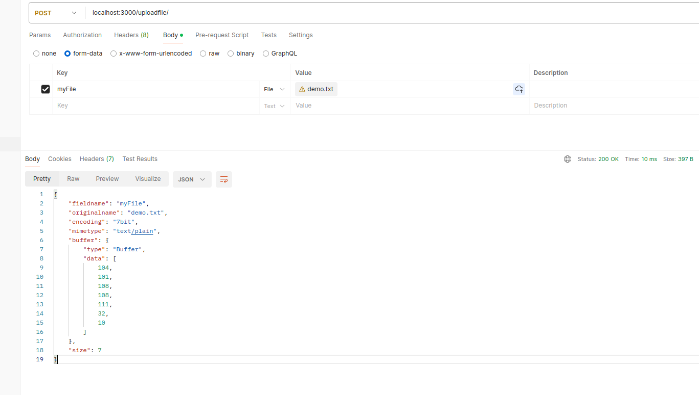

> https://viblo.asia/p/file-upload-voi-multer-nodejs-va-express-E375z4VdZGW

# Upload single-file



# Upload multiple-file

- In the route definition app.post('/uploadmultiple', upload.array('myFiles', 12), ...), the number 12 specifies the maximum number of files that the server will accept in a single request.

# Upload images

# Body-parser

## What is body-parser?

- body-parser is a piece of express middleware that reads a form's input and stores it as a javascript object accessible through req.body.
- In the Express 4.16.0 before, body-parser was built in express. But in the Express 4.16.0 and later, you have to install it separately.
- Using body-parser to parse the request body is essential in many web applications because it allows the server to extract data sent by the client in the request. Here are a few reasons why it's important:

- Accessing Form Data: In web applications, forms are a common way for users to input data. When a form is submitted, the data is sent as part of the request body. body-parser allows the server to parse this form data and extract it for processing.

- Processing API Requests: When building APIs, clients often send data in JSON format in the request body. body-parser can parse this JSON data and make it available for the server to work with.

- Handling AJAX Requests: Modern web applications often use AJAX (Asynchronous JavaScript and XML) to send data to the server without reloading the page. body-parser enables the server to parse the data sent via AJAX requests.

- Parsing Middleware: Express.js middleware functions can access the request object (req) and perform various tasks based on the request data. By using body-parser, you can ensure that middleware functions have access to parsed request bodies.

- Data Validation and Sanitization: Once the request body is parsed, the server can validate and sanitize the data to ensure it meets certain criteria and is safe to use. This is crucial for security and preventing malicious attacks like SQL injection or cross-site scripting (XSS).

```js
const express = require("express");
const bodyParser = require("body-parser");
const app = express();

// Parse URL-encoded data
app.use(bodyParser.urlencoded({ extended: true }));

// POST route to handle form submission
app.post("/submit", (req, res) => {
  console.log(req.body); // Contains form data
  res.send("Form submitted successfully!");
});

app.listen(3000, () => {
  console.log("Server is running on port 3000");
});
```

> If you don't use body-parser in this example, the req.body object will be undefined when you try to access it in the POST route handler.

### Here's how body-parser is useful with different HTTP methods:

- `POST` Method: With the POST method, it's common to send data in the request body, especially when submitting forms or sending JSON data. body-parser allows you to parse and access this data on the server.

- `PUT` and `PATCH` Methods: When updating resources using the PUT or PATCH methods, it's common to send the updated data in the request body. body-parser enables you to parse and access this data to update the resource accordingly.

- `DELETE` Method: While the DELETE method typically doesn't include a request body, there are cases where you might want to include data in the request body, such as specifying which resources to delete. In such cases, body-parser can parse and access the data sent in the request body.

- `GET` Method: The GET method typically does not include a request body, so body-parser is not typically used with GET requests. However, body-parser can still be configured to parse query parameters in the URL, which can be accessed using req.query.
