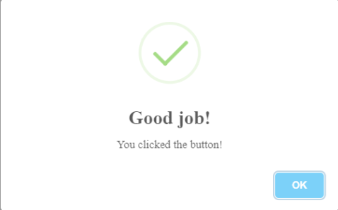
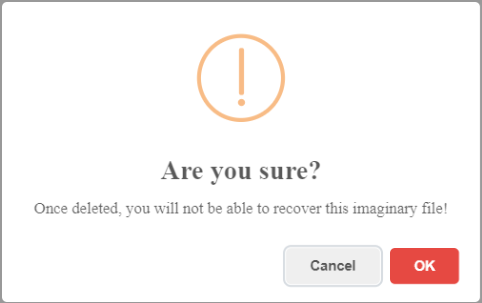
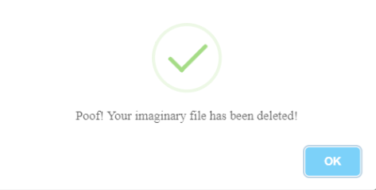

Github: https://github.com/t4t5/sweetalert
Docs: https://sweetalert.js.org/guides/#getting-started

### Notify

```js
swal({
  title: "Good job!",
  text: "You clicked the button!",
  icon: "success", //error, warning, info, success
  button: "Ok",
});
```

- Default for button is "Ok"



### User confirmation

```js
swal({
  title: "Are you sure?",
  text: "Once deleted, you will not be able to recover this imaginary file!",
  icon: "warning",
  buttons: true,
  dangerMode: true,
}).then((willDelete) => {
  if (willDelete) {
    swal("Poof! Your imaginary file has been deleted!", {
      icon: "success",
    });
  } else {
    swal("Your imaginary file is safe!");
  }
});
```






```text
buttons: true, // show confirm and cancel buttons
dangerMode: true, // apply red color for ok button
```
